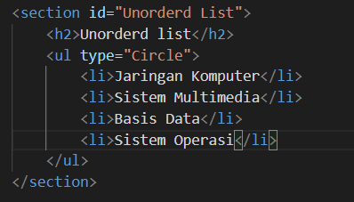

## Membuat-list-Table-dan-Form

# Membuat ordered list dan output nya

# Membuat unodered List dan Output nya

# Membuat Description List dan Output nya

# Membuat Tabel
<!DOCTYPE html>
<html lang="en">
<head>
    <meta charset="UTF-8">
    <meta name="viewport" content="width=device-width, initial-scale=1.0">
    <title>Membuat Tabel</title>
</head>
<body>
    <header>
        <h1>Membuat Tabel</h1>
    </header>
    
</body>
</html>

# Mengatur margin dan padding

output nya

# Menggabungkan sell data

outputnya

# Membuat Form
<!DOCTYPE html>
<html lang="en">
<head>
    <meta charset="UTF-8">
    <meta name="viewport" content="width=device-width, initial-scale=1.0">
    <title>Membuat Form</title>
</head>
<body>
    <header>
        <h1>Membuat Form</h1>
    </header>  
</body>
</html>

outputnya

# Menambahkan Style Pada Form

Outputnya

# Pertanyaan dan tugas
1. Buatlah form yang menampilkan dropdown menu dan listbox dengan multiple selection.
Dropdown menu
<!DOCTYPE html>
<html>
<head>
    <meta charset="UTF-8">
    <meta name="viewport" content="width=device-width, initial-scale=1">
    <title>Form dropdown & Listbox with multiple selection</title>
    <link rel="stylesheet" type="text/css" href="stylecss/css/style.css">
</head>
<body>
    

        

        
     

     

        <h1>Form UPB</h1>
    

<form action="proses.php" method="post">
<fieldset>
    <legend>Data Mahasiswa</legend>
    <label for="nama">Nama</label>
    <input type="text" id="nama" name="nama">
    <label for="nim"> NIM</label>
    <input type="text" id="nim" name="nim">
    <label for="jurusan">Jenis Kelamin</label>
    <input id="Jk_l" type="radio" name="Kelamin" value="L" />
    <label for="jkl_l">Laki-laki</label>
    <input id="Jk_p" type="radio" name="Kelamin" value="P" />
    <label for="jk_p">Perempuan</label>
     
     
    <label for="jurusan">Jurusan(Dropdown)</label>
    <select name="jurusan">
        <option value=""selected="selected">--Pilih Jurusan--</option>
        <option value="ti">Teknik Informatika</option>
        <option value="si">Sistem Informasi</option>
        <option value="hi">Hubungan Internasional</option>
    </select>
     
    <label for="jurusan2">Jurusan (multiple selection)</label>
    <select multiple name="drawfs" id="jurusan">
        <option value="ti">Teknik Informatika</option>
        <option value="si">Sistem Informasi</option>
        <option value="hi">Hubungan Internasional</option>
    </select>
     
    <label for="alamat">Alamat</label>
    <textarea id="alamat" name="alamat" cols="20" rows="3"></textarea>
    

        <input type="submit" value="Daftar">
    

   </fieldset>
  </form>
 </body>
</html>

Menambahkan CSS Style

body{
    margin: 2% auto;
    width: 40%;
    font-family: arial;
    font-size: 17px;
    line-height: 25px;
}
.header{
    display: flex;
    align-items: center;
    justify-content: flex-start;
}
.logo{
    width: 110px;
}
form > label {
    display: inline-block;
    width: 100px;
}
form input[type="text"],
form select,
form textarea {
    border: 1px solid #197a43;
    width: 100%;
 padding: 6px 10px;
 margin: 3px 0;
 box-sizing: border-box;
 font-size: 15px;
}
form input[type="submit"] {
    border:  5px solid #04AA6D;
    background-color:#04AA6D;
    color: #ffffff;
    padding: 5px 15px;
    border-radius: 10px;
    font-size: 15px;
}
select {
    width: 100%;
    height: 30px;
    padding: 16px 20px;
    border: none;
    border-radius: 4px;
    background-color: #fff;
}
#jurusan{
    height: 60px;
}
@media only screen and (max-width: 760px) {
   body {
       width: 90%;
   } 
}

Output Nya

Alhamdulillah

